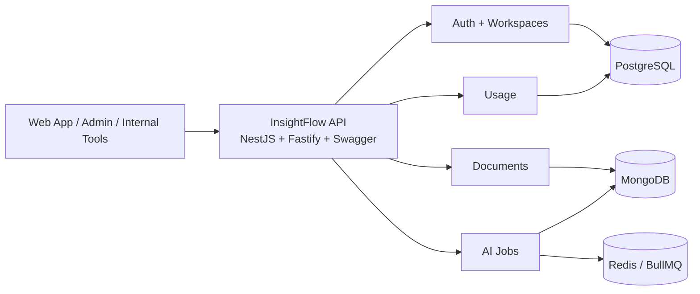
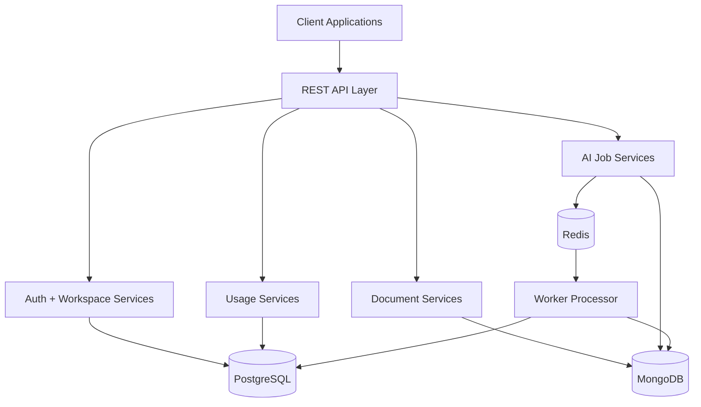

# InsightFlow Architecture

InsightFlow is a **modern AI product backend** designed around four portfolio-worthy themes:
- AI SaaS backend design
- async processing
- usage metering
- multi-tenant product architecture

---

## 1. System overview



---

## 2. Dual-database highlight

```text
PostgreSQL
├── Users
├── Organizations / Workspaces
├── Billing-ready usage records
└── Usage Events

MongoDB
├── Workflow Runs
├── AI Outputs
├── Documents
├── Embeddings Metadata
└── Execution Logs
```

---

## 3. Why the architecture is split this way

### PostgreSQL
Used for data that benefits from strong relational consistency:
- users
- workspaces
- memberships
- usage events

This is important because identity, tenant membership, and usage metering typically feed billing, permissions, and reporting.

### MongoDB
Used for flexible AI/product payloads:
- documents
- workflow runs
- AI outputs
- execution logs
- embedding metadata placeholders

This is useful because AI outputs and execution traces often evolve faster than relational business entities.

### Redis + BullMQ
Used for async workflow orchestration:
- queued AI tasks
- retry handling
- processing decoupling
- worker-based execution

This is important for AI products because inference, extraction, summarization, and classification are not ideal as blocking request/response operations.

---

## 4. Container / component view



---

## 5. Implemented module responsibilities

### Auth
- registration
- login
- refresh token rotation
- current-user profile retrieval

### Workspaces
- list workspaces by membership
- fetch workspace details by slug
- return members and recent documents

### Documents
- ingest document payloads
- store metadata and content in MongoDB
- list workspace documents
- fetch document with workflow run history

### AI Jobs
- create workflow runs
- enqueue jobs to BullMQ
- process jobs in worker
- store AI outputs and execution logs
- retry failed runs
- expose workflow run detail API

### Usage
- track document and workflow events
- track token estimates
- aggregate usage by metric
- expose workspace overview with soft limits

---

## 6. Cross-cutting concerns

### Security
- JWT bearer auth
- membership validation before workspace access
- owner/admin/member/analyst role model in relational layer

### Observability
- execution logs per workflow run
- status transitions persisted in MongoDB
- usage events persisted in PostgreSQL

### Extensibility
- provider service can be swapped for real AI integrations
- embedding metadata can evolve into a vector pipeline
- usage events can feed billing/subscription logic
- queue model can scale into dedicated worker deployments

---

## 7. Current strengths

InsightFlow already presents well as a showcase for:
- AI SaaS backend foundations
- long-running async job design
- hybrid database architecture
- billing-friendly usage metering
- clean NestJS service boundaries

---

## 8. Gaps before full production maturity

The project is strong as a portfolio/demo backend, but still has meaningful next steps:
- real model-provider integrations
- file/object storage integration
- vector retrieval pipeline
- billing and subscription orchestration
- tests and CI
- deployment and runtime observability
