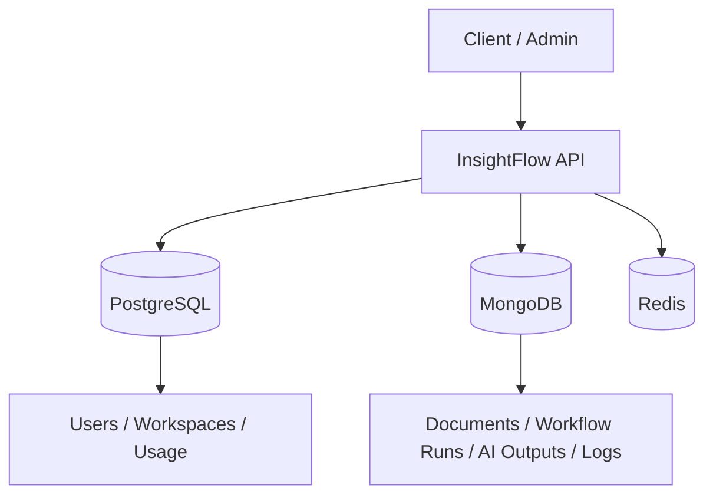

# InsightFlow Architecture

## Current scope
This first iteration demonstrates a **hybrid data architecture** for an AI SaaS backend.

## Why the split matters

### PostgreSQL handles
- relational identity and membership data
- organization/workspace structure
- usage and billing-friendly records

### MongoDB handles
- document payloads
- flexible AI outputs
- execution logs
- workflow run history
- embedding metadata

## Implemented modules
- Auth
- Workspaces
- Documents
- AI Jobs
- Usage

## Next iteration
- worker process
- provider abstraction
- billing module
- storage module
- vector metadata pipeline
