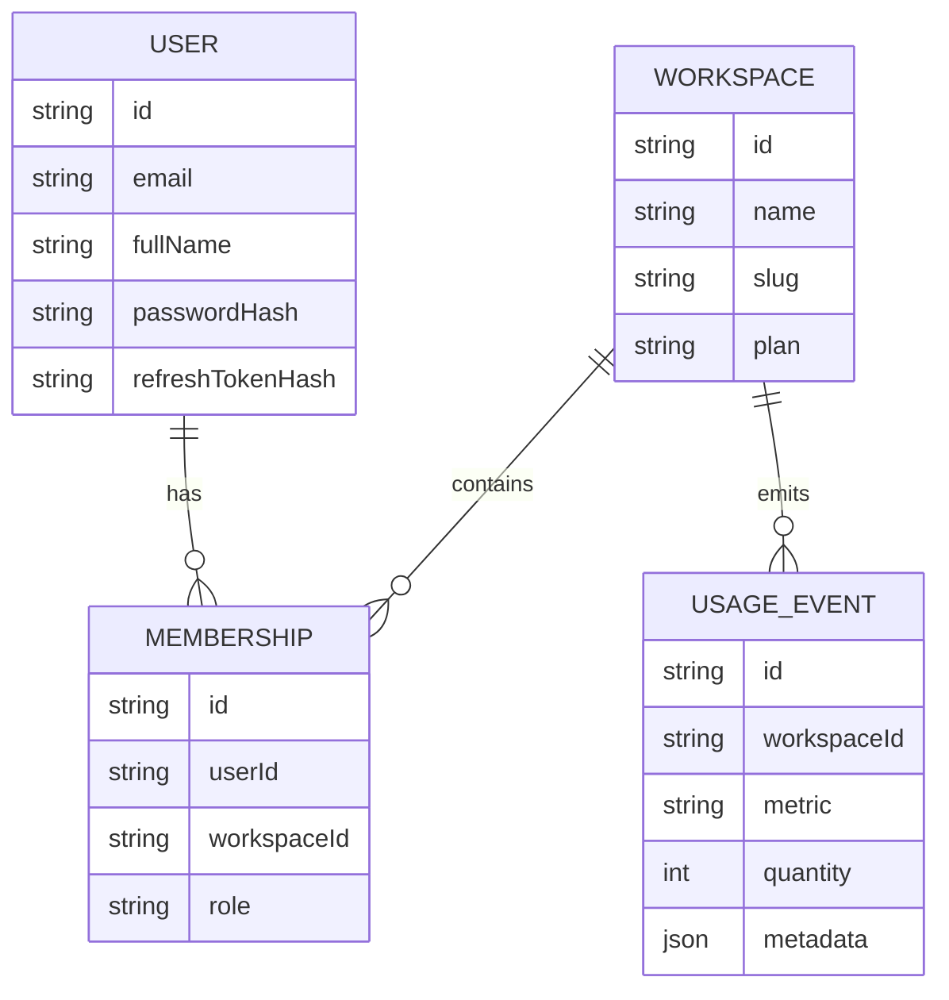

# InsightFlow Data Model

This document summarizes the split between relational business data and document-oriented AI payloads.

---

## Dual-database summary

```text
PostgreSQL
├── Users
├── Organizations
├── Billing
└── Usage

MongoDB
├── Workflow Runs
├── AI Outputs
├── Documents
├── Embeddings Metadata
└── Execution Logs
```

---

## 1. Relational model (PostgreSQL via Prisma)

### Core entities
- `User`
- `Workspace`
- `Membership`
- `UsageEvent`

### Relationship diagram



### Why PostgreSQL is used here
- identity and membership are relational
- role checks need predictable joins/constraints
- usage events are billing/reporting-friendly in SQL

---

## 2. Document model (MongoDB)

### Collections
- `documents`
- `workflow_runs`
- `ai_outputs`
- `execution_logs`

### Document shapes

#### `documents`
Stores:
- workspace ownership
- uploader identity
- document title/type/source
- raw content
- summary
- embedding metadata placeholder

#### `workflow_runs`
Stores:
- workspace and document linkage
- requested-by user
- workflow type
- status
- provider/model metadata
- token estimate
- output reference
- queue job id
- timestamps and error fields

#### `ai_outputs`
Stores:
- workflow linkage
- provider/model metadata
- structured AI output payload

#### `execution_logs`
Stores:
- workflow linkage
- log level
- message
- metadata payload
- timestamp

---

## 3. Why MongoDB is used here

MongoDB is a good fit for this layer because:
- documents can vary in size and shape
- AI outputs often evolve over time
- execution logs are append-friendly
- embedding metadata is flexible and iterative

---

## 4. Data ownership strategy

### PostgreSQL owns
- auth state
- tenant model
- role assignments
- plan and usage metrics

### MongoDB owns
- content payloads
- workflow state history
- AI outputs
- workflow logs

This split mirrors many real AI products where operational content evolves faster than business identity data.
