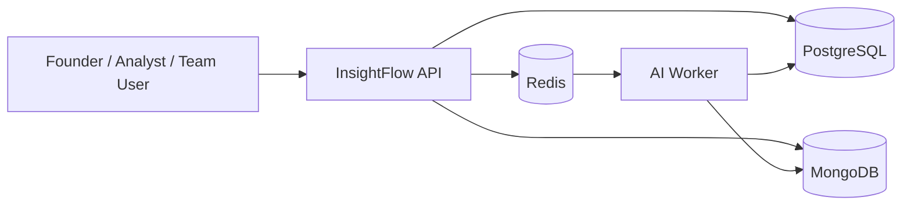

# InsightFlow HLD (High-Level Design)

This document describes InsightFlow from a solution-architecture perspective.

---

## 1. Purpose

InsightFlow is a backend foundation for AI-enabled SaaS products that need:
- secure authentication
- multi-tenant workspaces
- document ingestion
- async AI workflow execution
- usage metering for quota/billing readiness

---

## 2. Functional scope

### Included
- owner registration and login
- refresh token flow
- workspace listing and detail access
- document creation and retrieval
- AI workflow queueing
- AI workflow processing with retries
- workflow run detail and execution logs
- usage overview by workspace

### Intended future scope
- real model-provider integrations
- billing and subscriptions
- vector search / retrieval
- file storage for uploaded assets
- advanced observability and admin tooling
- test automation and CI

---

## 3. External interfaces

### Client-facing
- REST API over HTTP
- Swagger documentation

### Infrastructure-facing
- PostgreSQL for relational business data
- MongoDB for AI and document payloads
- Redis/BullMQ for async jobs
- Docker Compose for local development

### AI-facing
- provider abstraction point for OpenAI / Anthropic / Azure OpenAI

---

## 4. Context diagram

---

## 5. Logical containers

### API container
Responsible for:
- routing
- validation
- auth
- membership checks
- request orchestration
- queue submission

### Worker container
Responsible for:
- taking queued AI jobs
- calling AI provider logic
- persisting outputs
- writing execution logs
- updating usage metrics

### PostgreSQL container
Responsible for:
- users
- workspaces
- memberships
- usage events

### MongoDB container
Responsible for:
- documents
- workflow runs
- AI outputs
- execution logs

### Redis container
Responsible for:
- queue buffering
- retry coordination
- async decoupling

---

## 6. Non-functional intent

- **Maintainability**: clean NestJS module boundaries
- **Scalability**: worker-ready async architecture
- **Security**: JWT auth and workspace membership checks
- **Flexibility**: schema-friendly split between relational and document stores
- **Portfolio clarity**: architecture matches common AI SaaS client needs

---

## 7. Success criteria

InsightFlow succeeds as a showcase if a client quickly sees that it supports:
- AI SaaS backend design
- async background processing
- usage-metered product architecture
- multi-tenant workspace isolation
- extensible foundations for real AI integrations
