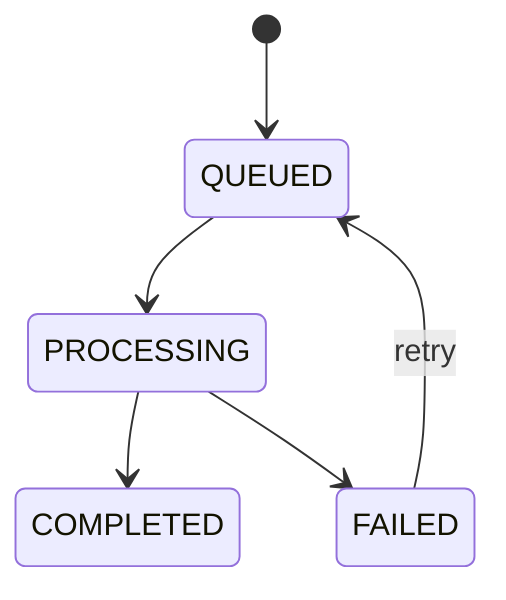

# InsightFlow LLD (Low-Level Design)

This document describes InsightFlow at the module, service, and data-interaction level.

---

## 1. Module breakdown

### Health Module
Responsibilities:
- expose health endpoint
- confirm service readiness at API level

### Auth Module
Responsibilities:
- register workspace owner
- issue access and refresh tokens
- rotate refresh token on refresh
- return current user profile and workspaces

Key files:
- `src/modules/auth/auth.controller.ts`
- `src/modules/auth/auth.service.ts`
- `src/modules/auth/dto/*`

### Workspaces Module
Responsibilities:
- list workspaces accessible to current user
- fetch workspace by slug
- return members and recent documents

### Documents Module
Responsibilities:
- ingest documents into MongoDB
- create document-linked usage events
- list workspace documents
- fetch document details and linked workflow runs

### AI Jobs Module
Responsibilities:
- create workflow run records
- enqueue jobs into BullMQ
- process queued jobs in worker
- store outputs and execution logs
- retry failed workflow runs

Key files:
- `src/modules/ai-jobs/ai-jobs.controller.ts`
- `src/modules/ai-jobs/ai-jobs.service.ts`
- `src/modules/ai-jobs/ai-jobs.processor.ts`

### Usage Module
Responsibilities:
- aggregate usage events by metric
- expose soft-limit and remaining-quota overview

---

## 2. Shared infrastructure components

### `PrismaService`
Provides:
- PostgreSQL connectivity
- relational persistence for users, workspaces, memberships, usage events

### `MongoService`
Provides:
- MongoDB connectivity
- collection access for documents, workflow runs, outputs, logs

### `QueueService`
Provides:
- BullMQ queue access
- job enqueueing with retry/backoff settings

### `AiProviderService`
Provides:
- AI processing abstraction point
- current mock output generation based on document content and job type

### Guards and decorators
- `JwtAuthGuard` — bearer token verification
- `CurrentUser` — request user injection
- `Roles` / `WorkspaceRoleGuard` — role-based metadata support

---

## 3. Main runtime interactions

### Registration path
1. client submits owner registration
2. service creates user in PostgreSQL
3. service creates workspace in PostgreSQL
4. service creates owner membership
5. service issues access and refresh tokens
6. refresh token hash is stored on user record

### Document ingestion path
1. authenticated user submits document payload
2. membership is validated against workspace
3. document is stored in MongoDB
4. embedding metadata placeholder is attached
5. usage event is written to PostgreSQL

### AI workflow path
1. authenticated user submits AI job request
2. workspace membership is validated
3. workflow run is created in MongoDB with `QUEUED` status
4. queue job is pushed to Redis/BullMQ
5. worker consumes the queue item
6. worker updates run to `PROCESSING`
7. provider service generates output
8. output is stored in MongoDB
9. workflow run updates to `COMPLETED` or `FAILED`
10. execution logs are written to MongoDB
11. usage events are written to PostgreSQL

---

## 4. Workflow state model

---

## 5. Key implementation notes

- refresh tokens are hashed before persistence
- workspace membership gates all tenant-sensitive routes
- AI outputs are stored separately from workflow run metadata
- execution logs are append-style records for tracing workflow stages
- token usage is currently estimated from content length
- provider execution is currently mocked but isolated behind a service boundary

---

## 6. Best candidates for next refinement

- swap mock provider with real provider adapters
- split worker into separate runtime process
- add DTO response contracts for all read endpoints
- add tests for auth, document, workflow, and usage modules
- add queue monitoring and structured logging
- add storage abstraction for files and parsed assets
