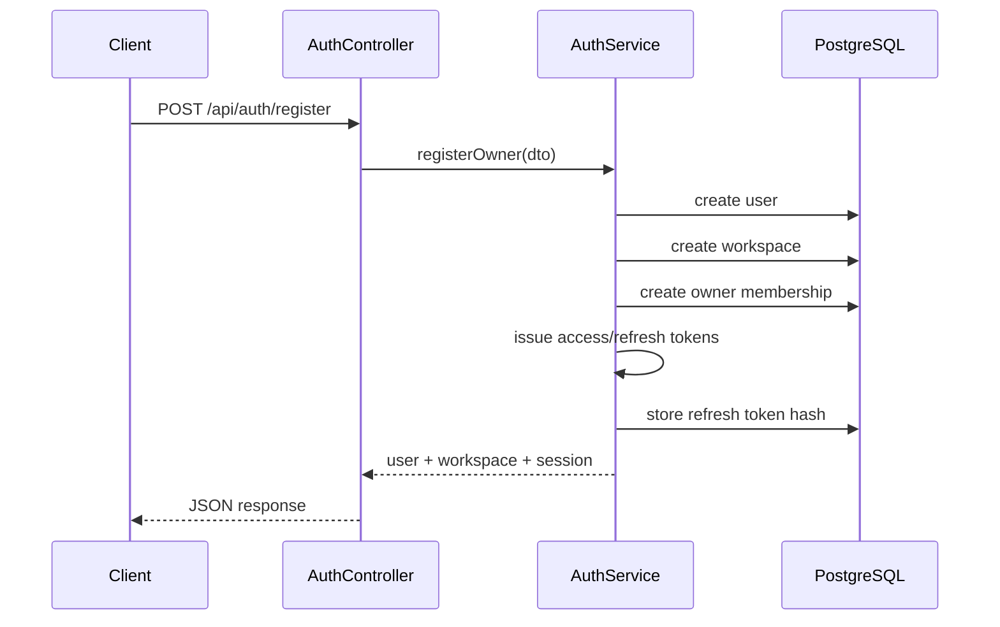
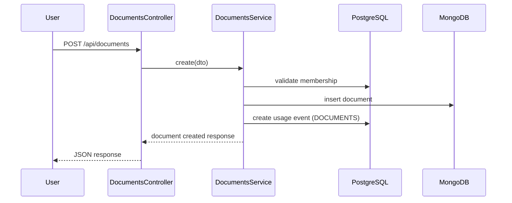
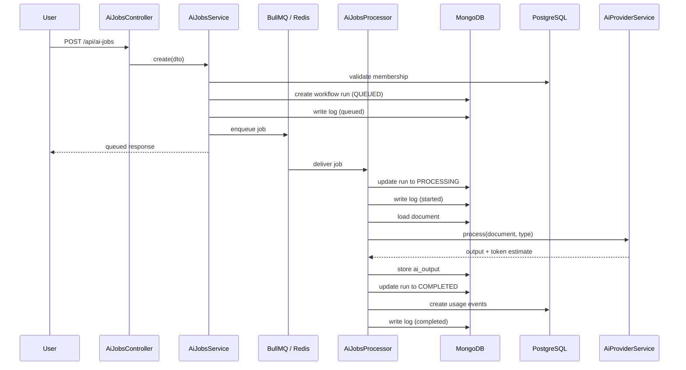
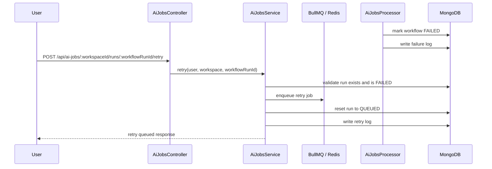

# InsightFlow Request Flows

This document captures the most important API and workflow journeys.

---

## 1. Owner registration flow

---

## 2. Document ingestion flow

---

## 3. AI workflow queue + worker flow

---

## 4. Workflow failure + retry flow

---

## 5. Usage overview flow

1. authenticated user calls `GET /api/usage/:workspaceId/overview`
2. service validates membership
3. recent usage events are fetched from PostgreSQL
4. usage is grouped by metric (`TOKENS`, `DOCUMENTS`, `WORKFLOW_RUNS`)
5. soft limits are resolved from workspace plan
6. remaining quota is calculated and returned
